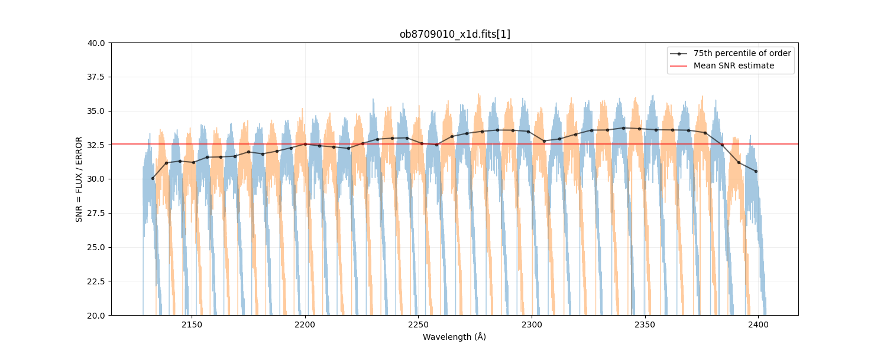
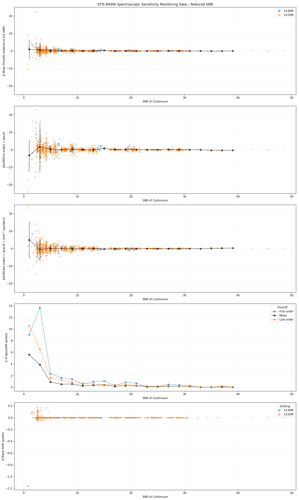
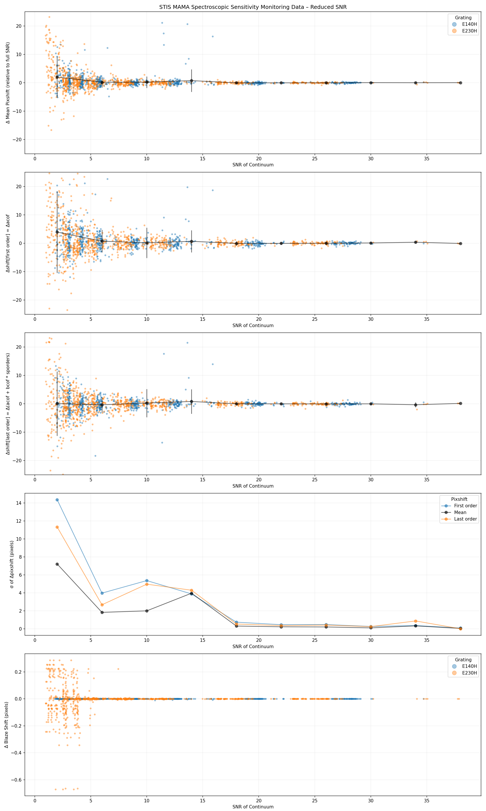

Simulations of Blaze Shift vs SNR
---------------------------------

We performed simulations on the performance of `stisblazefix` for a range of
signal-to-noise (SNR) levels as part of the `ULLYSES DR7`_ reduction in order to determine
the behavior of the algorithm at lower SNR, and thus when to apply it.  We used
observations of STIS standard white dwarfs from the *MAMA Spectroscopic Sensitivity and
Focus Monitor* programs.

.. _`ULLYSES DR7`: https://ullyses.stsci.edu/ullyses-dr7.html#Appendix

We estimated the average continuum SNR of each echelle X1D dataset by taking the
FLUX/ERROR column ratio, trimming out 100 pixels from both edges of each order,
calculating the 75th percentile value for each order, and taking the mean across all
orders. This proved to be robust to emission & absorption lines and to the blaze function
edge behavior.

  An estimate of the continuum SNR for an example ``E230H/c2263/0.2X0.2`` dataset.

We randomly subsampled the measured counts in the monitor datasets at levels of
[0.5, 1, 2, 5, 10, 25, 50]%, giving a range of continuum flux levels, and corresponding
SNR. The subsampled datasets were processed with `CalSTIS`_ and `stisblazefix` to derive
the blaze shift offset at the far orders and the mean across all orders. We differenced
these values with those derived from the corresponding full dataset.

.. _`CalSTIS`: https://stistools.readthedocs.io/en/latest/calstis.html

When plotted against SNR, the scatter in the `stisblazefix` mean blaze correction
increases to >2 pixels at SNR=5 for the M-modes and ~3 pixel at SNR=10 for H-modes. These
thresholds also conservatively correspond to a sudden increase in scatter of the
`CalSTIS`-calculated blaze shift value (Δ in the SCI ext ``BLZSHIFT`` keyword).

  **M-modes**

  **Top three panels:** The scatter in the `stisblazefix` empirically-derived blaze shift
  offset in subsampled monitor data, relative to the full datasets. The panels correspond
  to the mean, first, and last order of each dataset, respectively. The black points bin
  the results every 4 SNR.

  **Fourth panel:** The scatter within each SNR bin, showing roughly where the correction
  becomes unreliable.

  **Fifth panel:** The ΔBLZSHIFT, as calculated by calstis.

  **Same as previous figure, except for H-modes.**
